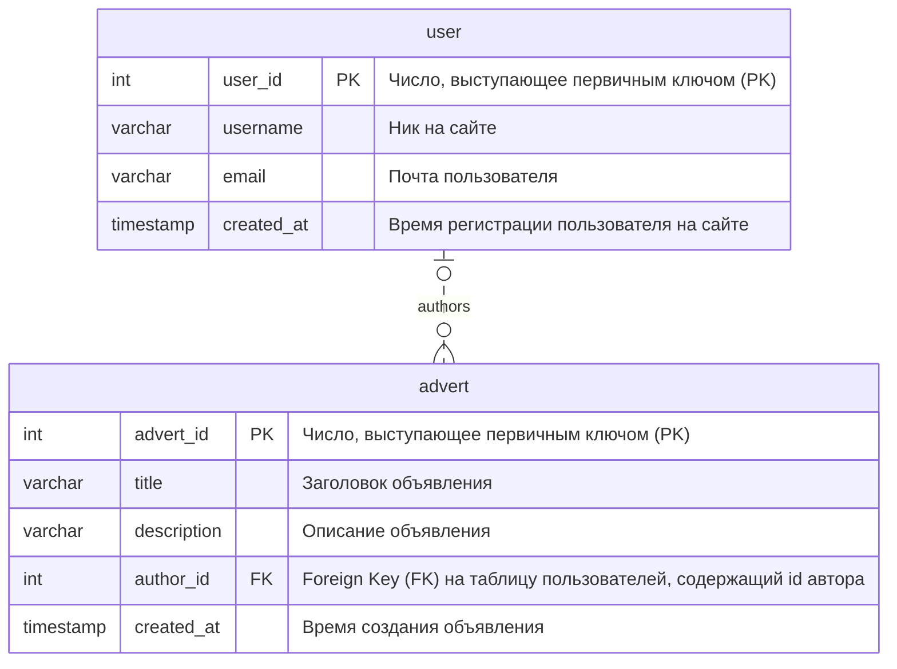

# Инструменты для проектирования баз данных

## Введение

Работу с базами данных можно очень условно разделить на две большие категории:

1. Проектирование
1. Использование

В этой статье мы сосредоточимся на проектировании, а если даже точнее --- на инструментах, помогающих нам это делать. Проектирование баз данных --- это занятие, как правило, требующее большой внимательности, но не требует от вас знания какой-то конкретной технологии, языка программирования или языка запросов

> Эта статья ориетированна на реляционные СУБД, большая часть написанного здесь почти непринимо к другим видам баз данных

Проектирование базы данных --- это своего рода работа "карандашом", ваша задача просто нарисовать схему, которая логически отвечает требованиям. Такие требования могут включать в себя:

- Бизнес-ценность (база описывает сущности, отвечающие задаче)
- Нормализация и другие технические элементы

Как вы знаете из лекции, существует много нормальных форм, и все они строятся одна на предыдущей. Однако, большую часть времени, вам не стоит заморачиваться дальше, чем приведение к 3 нормальной форме.

## Историческая справка

Реляционные базы появились достаточно давно и за это время успело смениться несколько привычных инструментов и подходов к проектированию. Но так как эта деятельность результируется просто в схеме, визуальном отражении базы, на практике эти отличия можно утрировать в принцип *"вместо квадратов теперь рисуем круги!"*

Давным-давно, в далекой галактике, был такой способ изображения `Chen's Notation` (Нотация Чена). С более подробным описанием можно ознакомиться вот [здесь](https://vertabelo.com/blog/chen-erd-notation/).

Для примера покажу, как выглядит простая диаграмма[^chen-notation-example]:

[^chen-notation-example]: взято с <https://vertabelo.com/blog/chen-erd-notation/> 
> Здесь можно увидеть очень простую схему, которая описывает, что у книги есть название и `BOOK ID`, выступающий в качестве `PRIMARY KEY`. Также есть вторая сущность --- "глава книги", имеющая название и `CHAPTER ID` в качестве `PRIMARY KEY`. 
> 
> Их отношение здесь отражено ромбом, а линии подсказывают, что отношение `BOOK` -- `CHAPTER` --> один ко многим (у одной книги -- много глав, но у одной главы -- только одна книга)

В нотации Чена достаточно неудобно показывать большие таблицы, и, со временем, пришли `ER-диаграммы`

## ER диаграммы

> ER расшифровывается как `Entity Relationship`, то есть "Отношение сущностей". Их могут называть также `ERD` (`Entity Relationship Diagram`).
> 
> Не удивляйтесь, если еще встретите название `Crow's foot notation` (Нотация вороньей лапки) --- из-за специфической формы линий, указывающих на отношения, их так окрестили.

Большая часть популярных инструментов для рисования всяких схем могут быть использованы для рисования ER диаграм, например:

- `draw.io` (<https://app.diagrams.net/>)
- `Microsoft Visio` (<https://www.microsoft.com/en-us/microsoft-365/visio/flowchart-software>)
- `Mermaid` (<https://mermaid-js.github.io/mermaid/#/>)
- и другие

Как выглядят ER:

