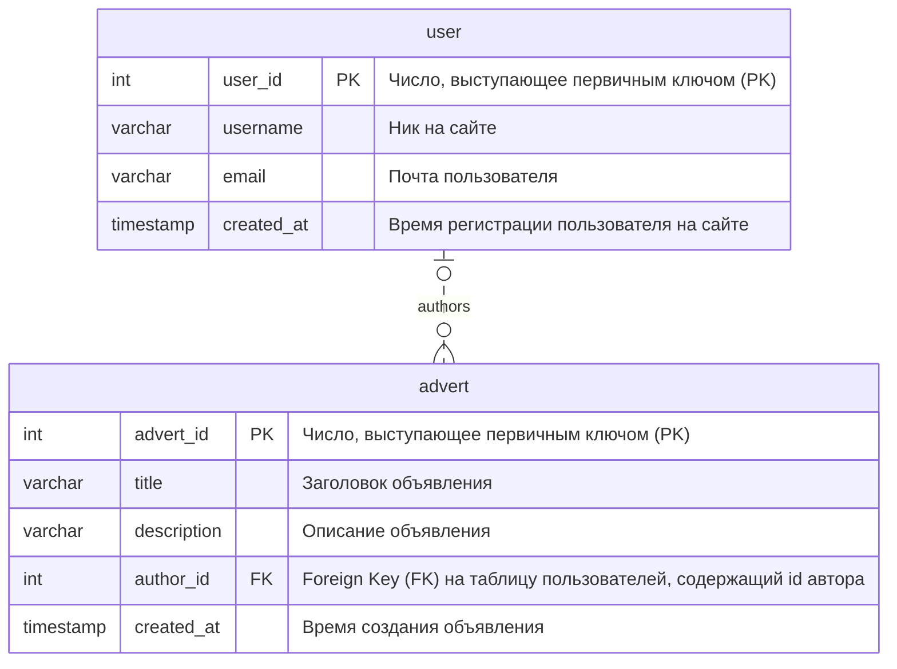
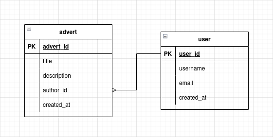
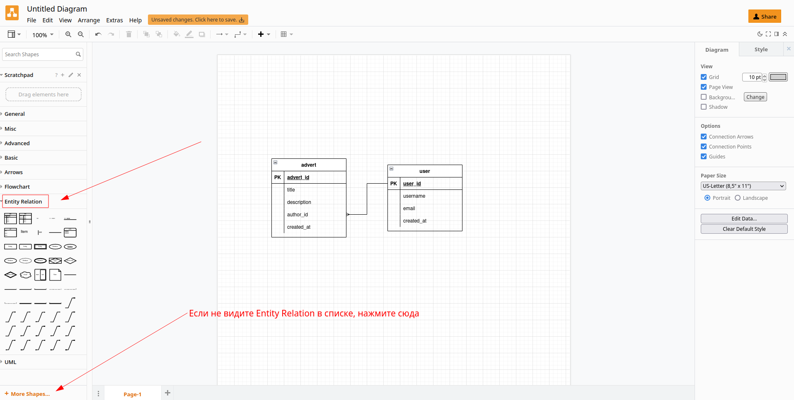

# Инструменты для проектирования баз данных

## Введение

Работу с базами данных можно очень условно разделить на две большие категории:

1. Проектирование
1. Использование

В этой статье мы сосредоточимся на проектировании, а если даже точнее --- на инструментах, помогающих нам это делать. Проектирование баз данных --- это занятие, как правило, требующее большой внимательности, но не требует от вас знания какой-то конкретной технологии, языка программирования или языка запросов

> Эта статья ориетированна на реляционные СУБД, большая часть написанного здесь почти непринимо к другим видам баз данных

Проектирование базы данных --- это своего рода работа "карандашом", ваша задача просто нарисовать схему, которая логически отвечает требованиям. Такие требования могут включать в себя:

- Бизнес-ценность (база описывает сущности, отвечающие задаче)
- Нормализация и другие технические элементы

Как вы знаете из лекции, существует много нормальных форм, и все они строятся одна на предыдущей. Однако, большую часть времени, вам не стоит заморачиваться дальше, чем приведение к 3 нормальной форме.

## Историческая справка

Реляционные базы появились достаточно давно и за это время успело смениться несколько привычных инструментов и подходов к проектированию. Но так как эта деятельность результируется просто в схеме, визуальном отражении базы, на практике эти отличия можно утрировать в принцип *"вместо квадратов теперь рисуем круги!"*

Давным-давно, в далекой галактике, был такой способ изображения `Chen's Notation` (Нотация Чена). С более подробным описанием можно ознакомиться вот [здесь](https://vertabelo.com/blog/chen-erd-notation/).

Для примера покажу, как выглядит простая диаграмма[^chen-notation-example]:


[^chen-notation-example]: взято с <https://vertabelo.com/blog/chen-erd-notation/> 
> Здесь можно увидеть очень простую схему, которая описывает, что у книги есть название и `BOOK ID`, выступающий в качестве `PRIMARY KEY`. Также есть вторая сущность --- "глава книги", имеющая название и `CHAPTER ID` в качестве `PRIMARY KEY`. 
> 
> Их отношение здесь отражено ромбом, а линии подсказывают, что отношение `BOOK` -- `CHAPTER` --> один ко многим (у одной книги -- много глав, но у одной главы -- только одна книга)

В нотации Чена достаточно неудобно показывать большие таблицы, и, со временем, пришли `ER-диаграммы`

## ER диаграммы

> ER расшифровывается как `Entity Relationship`, то есть "Отношение сущностей". Их могут называть также `ERD` (`Entity Relationship Diagram`).
> 
> Не удивляйтесь, если еще встретите название `Crow's foot notation` (Нотация вороньей лапки) --- из-за специфической формы линий, указывающих на отношения, их так окрестили.


Большая часть популярных инструментов для рисования всяких схем могут быть использованы для рисования ER диаграм, например:

- `draw.io` (<https://app.diagrams.net/>)
- `Microsoft Visio` (<https://www.microsoft.com/en-us/microsoft-365/visio/flowchart-software>)
- `Mermaid` (<https://mermaid-js.github.io/mermaid/#/>)
- и другие

### Суть нотации

Таблицы[^table-alternative-terms] изображаются в виде прямоугольника-таблицы. В "шапке" --- название всей таблицы. Внутри, в виде рядов этой таблицы изображаются *аттрибуты*

> Кроме названий и аттрибутов может присутствовать дополнительная информация, например:
> - тип данных аттрибута
> - Пометка, является ли аттрибут ключом (первичным или внешним)
> - Дополнительное описание значения поля
> - и другие
> 
> Тем не менее, **самое главное, чтобы было название аттрибута**, остальное, в целом, можно считать опциональным

Отношения[^relationship-alternative-terms] изображаются в виде линий от таблицы к таблице, или даже от конкретного аттрибута таблицы к другой таблице. Они символизируют связь таблиц через `Foreign Key`[^foreign-key-alternative-terms]

> В зависимости от рода связи, линия может иметь своего рода тройное окончание --- та самая "воронья лапка", по которой прозвали нотацию.
> 
> В общем --- можете не заморачиваться, эти лапки по сути дублируют информацию из таблицы, но it's nice to have them, позволяет не всматриваться в структуру, быстро окинуть взглядом и уловить общую идею.

[^table-alternative-terms]: Их еще могут называть `сущности`, `entity`
[^relationship-alternative-terms]: Их еще могут называть `связи`, `relationships`
[^foreign-key-alternative-terms]: Также может называться внешним ключом или вторичным ключом

Как выглядят ER:



> Здесь мы видим две **сущности** (`entities`), связанных **отношением** (`relationship`) `one-to-many` 
> 
> У **одного** объявления --- может быть только **один** автор, но у **одного** автора --- может быть **много** объявлений

### Инструменты

#### Mermaid

Диаграмму из примера выше, я изобразил с помощью `mermaid`, используя следующий код:

```text
erDiagram
    advert {
        int advert_id PK "Число, выступающее первичным ключом (PK)"
        varchar title "Заголовок объявления"
        varchar description  "Описание объявления"
        int author_id FK "Foreign Key (FK) на таблицу пользователей, содержащий id автора"
        timestamp created_at "Время создания объявления"
    }

    user {
        int user_id PK "Число, выступающее первичным ключом (PK)"
        varchar username "Ник на сайте"
        varchar email "Почта пользователя"
        timestamp created_at "Время регистрации пользователя на сайте"
    }
    user |o..o{ advert : authors
```

Тем не менее, это был просто *способ удобный лично мне*[^mermaid-note]. Главня цель --- изобразить таблицы в виде прямоугольников и нарисовать линии с лапками

[^mermaid-note]: Не последнюю роль здесь сыграла нативная интеграция с GitHub
#### Draw.io

Вот пример аналогичной схемы, изображенной с помощью `draw.io`:



Для `draw.io` есть ряд шаблонов\компонентов, помогающий в проектировании. Так выглядит интерфейс программы



## Процесс проектирования

В общем случае, процесс проектирования выглядит примерно так:

1. Накидываете схему "широкими мазками"
1. Начинаете нормализовывать вашу схему
1. Ошибаетесь в чем-то
1. Repeat steps 2-3
1. ...
1. PROFIT!

### Общие советы

#### Не торопитесь

Процесс проектирования --- процесс умственного труда. Сразу хорошо может не выйти, общее правило как для вас, так и для более опытных разработчиков.

Проектирование баз данных --- действительно трудоемкое занятие, с большой ценой ошибки, даже если с виду так не кажется, прошу, не поддавайтесь иллюзорной простоте :)

Зачастую нужно несколько раз вернуться к одной и то же структуре, чтобы увидеть свои ошибки, не стесняйтесь выделять по паре дней на схему, если нужно

#### Проговаривайте вслух отношения

У вас всего 3 вида отношений:

- `one-to-one`
- `many-to-one`/`one-to-many`
- `many-to-many`

Они означают примерно следующее:

##### one-to-one

У одной записи в таблице "А" может быть только одна "Б", и у одной записи в таблице "Б" может быть только одна "А"

Пример:

```text
У одного пользователя может быть один username, а у одного username может быть только один user
```

> Здесь можно поспорить: а почему эти вещи не находятся в одной таблице, ведь username функционально зависит от user. На первый взгляд так и есть, но тут надо исходить от задачи, возможно, что вы храните не просто `username`, а еще и какую-то доп информацию, по типу языка, на котором он написан (зачем-то) или чего-то еще, что *функционально зависит* именно от `username`

##### one-to-many

У одной записи в таблице "А" может быть много "Б", но у одной записи в таблице "Б" может быть только одна "А"

Пример:

```text
У одного товара может быть только одна категория, но в одной категории может быть много товаров
```

##### many-to-many

У одной записи в таблице "А" может быть много "Б", и у одной записи в таблице "Б" может быть только много "А"

Пример:

```text
У одного лектора учится много студентов, а один студент учится у многих лекторов
```

---

Благодаря тому, что вы проговариваете это вслух, вам будет сложнее запутаться, потому что очень быстро можно скатиться во что-то наподобие "У меня много товаров и много категорий, значит --- many-to-many", хотя товары могут быть привязаны только к одной категории

#### Foreign Key всегда подскажет отношение

Там где `many` -- там и `Foreign Key`. 

Если у вас отношение `ТОВАР`---`КАТЕГОРИЯ` звучит как `many-to-one`, значит `FOREIGN KEY` будет в `ТОВАРЕ` к `КАТЕГОРИИ`


> Отношение `many-to-many` дробится на два `one-to-many`

#### Внимательно вникайте в бизнес-суть задачи

Все базы разные и в первую очередь опредеяются **конкретными задачами**. От дизайна базы во многом зависят возможности бэкэнда, например на вопрос:

```text
А я смогу найти всех производителей этой детали по запросу?
```

Вы скорее всего ответите: "Зависит от того, как у вас спроектирована база", так что влияние на бизнес у структуры огромное

> Это конечно, не означает, что если вы допустили оплошность вы закрыли для себя путь что-то сделать. Но вы вполне могли закрыть для себя *наименее болезненный* путь что-то сделать 
