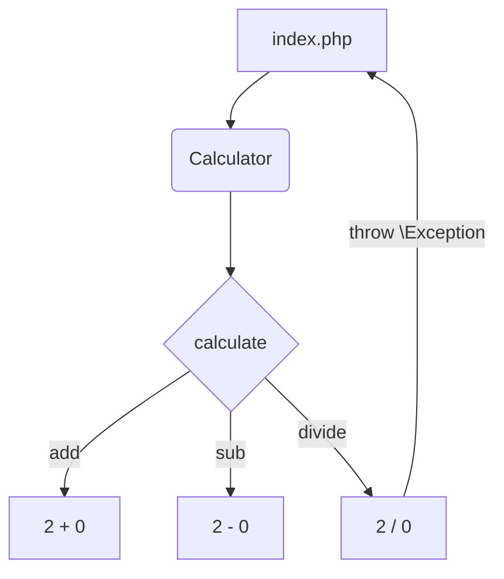

## Обработка ошибок в PHP
Есть два основных способа сообщать об ошибках в работе функции или метода:
1. Возврат значения, обозначающего ошибку. В этом способе мы возвращаем false или определённый код ошибки.
2. Выброс исключений.

### Возврат ошибки.

Первый способ очень простой и интуитивный. Раньше в PHP повсеместно использовался возврат `false`, в том числе в стандартных функциях.


**Пример использования:**
```php
class Calculator
{
    public function divide(int $a, int $b)
    {
        if ($b === 0) {
            return false;
        }
    
        return $a / $b;
    }
}

$calculator = new Calculator();
$result = $calculator->divide(1, 0);

if ($result === false) {
    echo 'Делить на 0 нельзя!';
} else {
    echo $result;
}
```
**Такой способ порождает много проблем:**

1. Сложно определить что именно за ошибка произошла.
2. Насколько глубоко по стеку вызова находится причина ошибки.
3. Портится типизация, теперь мы не можем достоверно сказать, что метод вернёт только один тип, или число в нашем случае. Теперь он может возвращать false.
3. Невозможно передать дополнительный контекст ошибки, даже если использовать числовой код.

**Пару слов про Go:**

В Go используется именно возврат ошибки, но благодаря возможности возврата нескольких значений и наличия строгой типизации, это не представляет больших проблем.

В PHP всё иначе, и возврат false при ошибках может привести к большим затратам времени на поиск ошибок, поэтому авторы языка приняли решение внедрить механизм исключений. Сейчас возвращать ошибки рекомендуется только в простейших случаях.

### Выброс исключений
**Исключения** - особые классы, которые позволяют прерывать исполнение кода и доставлять информацию об ошибке вверх по стеку вызовов.
**Исключение** - это класс [Exception](https://www.php.net/manual/ru/class.exception.php) и его наследники, реализующие интерфейс [Throwable](https://www.php.net/manual/ru/class.throwable.php).


Выброс исключения происходит с помощью ключевого слова `throw`, например так: `throw new \Exception('На 0 делить нельзя');` оно пройдёт наверх по стеку вызова до тех пор, пока не будет поймано конструкцией `try {} catch() {}`:
```php
try {
    $calculator->divide(1, 0);
} catch (\Exception $e) {
    echo $e->getMessage();
}
```
где **Exception** - это название класса вместе с неймспейсом.
Вы можете расширять классы исключений и использовать его методы внутри catch.
Пример выше с использованием исключений и вложенных методов:
```php
class Calculator
{  
    public function calculate(int $a, int $b, string $operator)
    {
        if ($operator === '/') {
            return $this->divide($a, $b);
        } elseif ($operator === '*') {
            return $this->multiply($a, $b);
        }
        //...
    }

    public function divide(int $a, int $b): int
    {
        if ($b === 0) {
            throw new \Exception('На 0 делить нельзя');
        }

        return $a / $b;
    }

}

$calculator = new Calculator();

try {
    echo $calculator->calculate(1, 0, '/');
} catch (\Throwable $e) {
    echo $e->getMessage(); // На 0 делить нельзя
}
```
Как видно, исключение прошло "сквозь" метод `calculate` и было поймано при его вызове. Несмотря на то, что исключение было выброшено в методе `divide`.

При сложной структуре проекта, можно отлавливать там, где будет удобнее сделать вывод ошибки.

### Встроенные типы ошибок в PHP
Кроме исключений, в PHP есть встроенные типы ошибок Notice, Fatal, Warning, Parse. Вы можете ознакомиться с ними в [статье](https://phoenixnap.com/kb/php-error-types)

### Полезные ссылки:
- [Официальная документация](https://www.php.net/manual/ru/language.exceptions.php)
- [Класс Exception](https://www.php.net/manual/ru/class.exception.php)
- [Встроенные типы ошибок](https://phoenixnap.com/kb/php-error-types)
