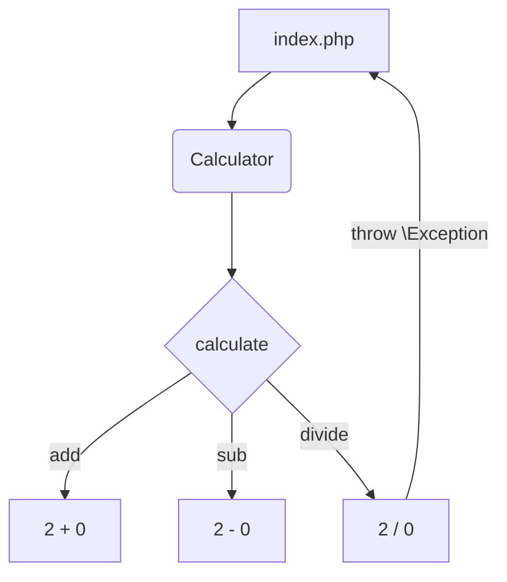

# Ошибки в программировании

> Как и почему мы ошибаемся?

## Что такое ошибка и какие они бывают?

>  Ошибка --- когда что-то не работает или не так, как надо

Есть разные способы классификации ошибок. В целях этой статьи, попробуем грубо поделить ошибки на несколько категорий:

- Ошибки в языке (синтаксические)
  - Если есть синтаксическая ошибка, из-за которой программа не компилируется\запускаетяс
  - Больше применимо к компилируемым языкам
    - Go
    - Java
    - C#
    - и другие
- Runtime ошибки (ошибки времени исполнения)
  - Программа смогла запуститься, но из-за ошибки **завершилась** или не может продолжать исполнение
  - Примеры:
    - Выход за пределы массива
    - Ошибки с кастингом\преобразованием типов
    - и т.д.
- Логические ошибки
  - Ваша программа запускается, но работает не так, как задумывалось

## Инженерная ценность

Исправление ошибок требует времени и сил. Поэтому наша задача --- создавать такие системы, которые требует **наименьшего количества времени на исправление**

Если попробовать ранжировать их по требованию времени и сил, можно попробовать выделить такую иерархию:

1. Ошибки компиляции
1. Runtime ошибки
1. Логические ошибки


То есть самые простые для работы и исправления --- ошибки компиляции[^compilation-errors]. Тут есть компилятор --- он подсказывает что нужно исправить и исправление можно протестировать просто попробовав еще раз запустить программу.

Runtime ошибки --- чуть сложнее. Вам нужно запустить программу и запустить нужный сценарий. Но у таких ошибок есть отличная черта, они **очевидны**. То есть вы сразу можете понять, что что-то идет не так, ведь программа закрашилась и заставляет вас действовать

Логические ошибки --- ваша программа работает неправильно, и это **неочевидно**. Вы вынужденны в процессе использования сами заметить, что что-то идет не так. Например, у вас неправильно работает расчет остатка суммы на счете, но никаких ошибок не выходит, **программа продолжает работать неправильно**

В общем случае --- вы хотите приводить ошибки *вверх по этой иерархии*. 

> То есть, ваша задача, как инженера: превращать логические ошибки в Runtime ошибки, а Runtime ошибки, в ошибки компиляции, *настолько, насколько это возможно\разумно*

### Присказка

Я не знаю, насколько достоверна эта информация, но мне очень нравится посыл, поэтому приведу здесь ее:

В процессе разработки подземных шахт, раньше широко использовались деревянные опоры, чтобы шахта не обрушилась. Однако дерево очень подвержено различного рода физического воздействия, потому они были относительно недолговечны
Тем не менее, их использовали широко, пока в какой-то момент не решили заменить их на стальные балки, ведь они очень прочные, и смогут прослужить дольше, чем деревянные. Через какое-то время, работники попросили вернуть деревянные балки обратно. Работники могли слышать треск дерева и вовремя заменять их, в то вермя как стальные балки были непредсказуемы --- они стояли *действительно дольше, но ломались разом*, в итоге опасность для работников оказавылась выше, ведь вероятность остаться погребенным в шахте была дольше.

Таким образом мы приходим к важному выводу:

> Очевидно ломаться **лучше** чем неочевидно работать с ошибкой

Есть обратный, но имеющий ту же логику пример с канарейками: канарейки очень громкие, и постоянно щебечат. Когда происходила утечка газа, люди не успевали это определить, прежде чем умирали. Канарейки очень маленькие, поэтому травились быстрее, переставали щебетать и люди замечали, что им грозит опасность[^canary]

[^canary]: Похожим образом используют "[Канареечные показания](https://en.wikipedia.org/wiki/Warrant_canary)" в юриспруденции
[^compilation-errors]: Серьезный пункт в пользу компилируемых языков и почему на них предпочитают строить большие системы

## Как это делать?

Давайте представим простой кейс: вы хотите написать простую функцию, которая отдает номер элемента в массиве (псевдокод):

```go
func find(int element, int[] array) int {
    for (int i = 0; i < array.length; i++) {
        if (array[i] == element) {
            return i;
        }
        ???
    }
}
```

Вопросительными знаками здесь отмечен следующий момент: *что делать, если элемент не нашелся?*

Здесь есть несколько вариантов:

- Вернуть 0 или любое положительное число
  - Очевидно плохой вариант --- вы никогда не понимаете, завершилась ли работа корректно
- Вернуть -1 
  - Здесь это в целом разумно, но тоже не до конца очевидно: придется указывать в документации, и, будем честные, не все, кто пользуется вашей функцией ее прочитают
- Вернуть дополнительно информацию о том, что что-то пошло не так
  - Популярный способ в языках для системного программирования
  - Программист "на принимающей стороне" сможет сам обработать логику реагирования на ошибку
  - Сложно объединять несколько ошибок сразу (в nested вызовах)
  - Основной способ работы с ошибками в Go
- Завершить исполнение работы программы, соообщив об ошибке
  - Радикально, но далеко не самый худший вариант
  - Именно в этом цель механизма `исключений`\`exceptions`
  - Если на "принимающей стороне" есть возможность обработать эту ошибку --- *крайне желательный вариант*

> Как видите пример очень простой, и первые два варианта обработки --- подвязаны именно под логику работы с числами, в то время как последние два --- более унивесальны 

## Исключения и с чем их едят

> Данный раздел содержит сведения общего характера по самому механизму исключений в языках, которые его поддерживают

Каждый раз, когда вы вызываете какой-то метод или функцию, большинство реализаций языков программирования, создают информацию о вызове новой функции и кладут ее в область в вашей оперативной памяти. Говоря более точно, они создают новый `frame`[^frame] для каждого вызова функций, который помещается в `stack` исполнения вашей программы 

[^frame]: Там программа хранит всякие локальные переменные и адрес инструкций, которые должны быть исполнены

`Stack` --- общее название специальных структур, реализованных таким образом, что новый элемент кладется "поверх" остальных, и можно вытащить только то, что "наверху". Представьте себе тарелки положенные друг на друга --- вы естественным образом кладете новую поверх, и достаете обратно их только сверху. Подробнее о стеках можно почитать [тут](https://ru.wikipedia.org/wiki/%D0%A1%D1%82%D0%B5%D0%BA)

Представьте такой сценарий:
```go
func main() {
    first()
    fourth()
}

func first() {
    second()
}

func second() {
    third()
}

func third() {
    ... //do something
}

func fourth() {
    ... //do something
}
```

В таком случае, когда программа будет исполняться, будут исполнены следующие шаги:

```markdown
1. Вызов `main` создает новый элемент в стаке:

| Состояние стека |
|:---------------:|
|      main       |


2. Затем вызывается новая функция, `first`, новый фрейм кладется сверху
 
| Состояние стека |
|:---------------:|
|      first      |
|      main       |

3. `first` вызывает `second`

| Состояние стека |
|:---------------:|
|     second      |
|      first      |
|      main       |

4. `second` вызывает `third`

| Состояние стека |
|:---------------:|
|      third      |
|     second      |
|      first      |
|      main       |

5. ЕСЛИ `third` завершается успешно, то она убирается из стека:

| Состояние стека |
|:---------------:|
|     second      |
|      first      |
|      main       |

6. Теперь получается, что `second` тоже завершился, так как там нет других инструкций:

| Состояние стека |
|:---------------:|
|      first      |
|      main       |

7. `first` -- то же самое


| Состояние стека |
|:---------------:|
|      main       |

8. Теперь `main` может продолжить исполнение и вызывает `fourth`

| Состояние стека |
|:---------------:|
|     fourth      |
|      main       |

9. ЕСЛИ `fouth` завершился успешно, то он завершается и его фрейм уходит из стека

| Состояние стека |
|:---------------:|
|      main       |

10. И наконец завершается `main`. Завершение `main` --- завершает исполнение программы

| Состояние стека |
|:---------------:|


```

## Обработка ошибок в PHP
Есть два основных способа сообщать об ошибках в работе функции или метода:
1. Возврат значения, обозначающего ошибку. В этом способе мы возвращаем false или определённый код ошибки.
2. Выброс исключений.

### Возврат ошибки.

Первый способ очень простой и интуитивный. Раньше в PHP повсеместно использовался возврат `false`, в том числе в стандартных функциях.


**Пример использования:**
```php
class Calculator
{
    public function divide(int $a, int $b)
    {
        if ($b === 0) {
            return false;
        }
    
        return $a / $b;
    }
}

$calculator = new Calculator();
$result = $calculator->divide(1, 0);

if ($result === false) {
    echo 'Делить на 0 нельзя!';
} else {
    echo $result;
}
```
**Такой способ порождает много проблем:**

1. Сложно определить что именно за ошибка произошла.
2. Насколько глубоко по стеку вызова находится причина ошибки.
3. Портится типизация, теперь мы не можем достоверно сказать, что метод вернёт только один тип, или число в нашем случае. Теперь он может возвращать false.
3. Невозможно передать дополнительный контекст ошибки, даже если использовать числовой код.

**Пару слов про Go:**

В Go используется именно возврат ошибки, но благодаря возможности возврата нескольких значений и наличия строгой типизации, это не представляет больших проблем.

В PHP всё иначе, и возврат false при ошибках может привести к большим затратам времени на поиск ошибок, поэтому авторы языка приняли решение внедрить механизм исключений. Сейчас возвращать ошибки рекомендуется только в простейших случаях.

### Выброс исключений
**Исключения** - особые классы, которые позволяют прерывать исполнение кода и доставлять информацию об ошибке вверх по стеку вызовов.
**Исключение** - это класс [Exception](https://www.php.net/manual/ru/class.exception.php) и его наследники, реализующие интерфейс [Throwable](https://www.php.net/manual/ru/class.throwable.php).


Выброс исключения происходит с помощью ключевого слова `throw`, например так: `throw new \Exception('На 0 делить нельзя');` оно пройдёт наверх по стеку вызова до тех пор, пока не будет поймано конструкцией `try {} catch() {}`:
```php
try {
    $calculator->divide(1, 0);
} catch (\Exception $e) {
    echo $e->getMessage();
}
```
где **Exception** - это название класса вместе с неймспейсом.
Вы можете расширять классы исключений и использовать его методы внутри catch.
Пример выше с использованием исключений и вложенных методов:
```php
class Calculator
{  
    public function calculate(int $a, int $b, string $operator)
    {
        if ($operator === '/') {
            return $this->divide($a, $b);
        } elseif ($operator === '*') {
            return $this->multiply($a, $b);
        }
        //...
    }

    public function divide(int $a, int $b): int
    {
        if ($b === 0) {
            throw new \Exception('На 0 делить нельзя');
        }

        return $a / $b;
    }

}

$calculator = new Calculator();

try {
    echo $calculator->calculate(1, 0, '/');
} catch (\Throwable $e) {
    echo $e->getMessage(); // На 0 делить нельзя
}
```
Как видно, исключение прошло "сквозь" метод `calculate` и было поймано при его вызове. Несмотря на то, что исключение было выброшено в методе `divide`.

При сложной структуре проекта, можно отлавливать там, где будет удобнее сделать вывод ошибки.

### Встроенные типы ошибок в PHP
Кроме исключений, в PHP есть встроенные типы ошибок Notice, Fatal, Warning, Parse. Вы можете ознакомиться с ними в [статье](https://phoenixnap.com/kb/php-error-types)

### Полезные ссылки:
- [Официальная документация](https://www.php.net/manual/ru/language.exceptions.php)
- [Класс Exception](https://www.php.net/manual/ru/class.exception.php)
- [Встроенные типы ошибок](https://phoenixnap.com/kb/php-error-types)
